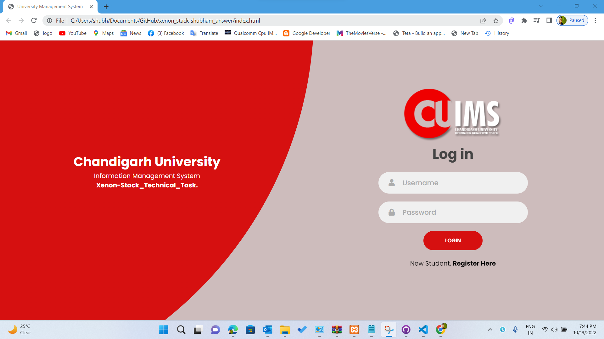

# xenon_stack_shubham_assignment

#This Project is Created using these technologies. HTML,CSS,JS,PHP.
#For Backend I use Mysql and connnect it via Xammp.
#if you want to use this website then before using this web site You have to downlload xamp and download this directory copy it to a folder named htdocs in xammp directory then You have to setup the database . firstly ypu have to create a database then table then databse rows  then in config.php file you have to declare database properties .

i setup the database like these.

</img>

<b> Screenschots of website </b>
 

<b>login page</b>
</img>
 
<b>Registration Page</b>
</img>
